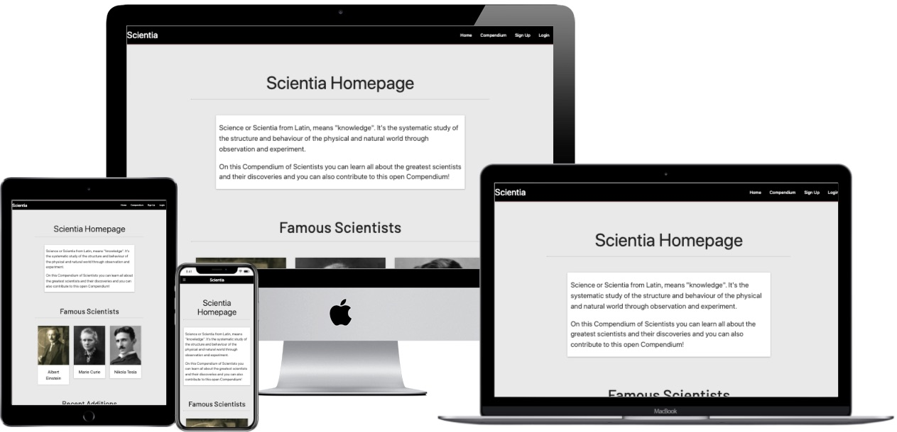
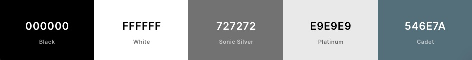
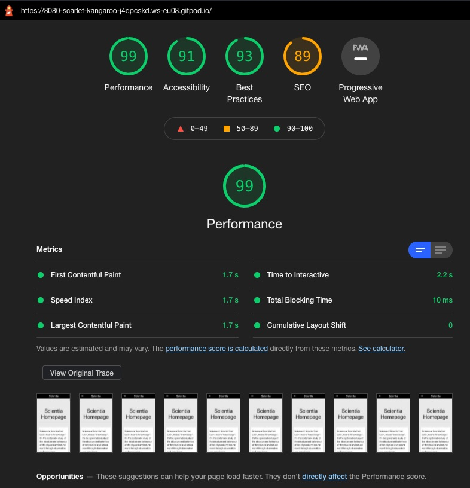

<h1 align="center">Milestone Project 3 - The Compendium of Scientists</h1>

[Click here to view the live project :link:](https://compendium-of-scientists.herokuapp.com/)

The Compendium of Scientists is a project created to gather information about all the scientists that contributed in any scientific area and that helped in the development of our society as we know it. The project idea was to developed an open website, similar Wikipedia, where any registered member can contribute to the Compendium of Scientists by adding and modifying any scientist in the database.

# Table Of Contents

1. [User Experience (UX)](#user-experience)
    - [User stories](#user-stories)
    - [Design](#design)
    - [Wireframes](#wireframes)
2. [Features](#features)
3. [Technologies Used](#technologies-used)
4.  [Languages Used](#languages-used)
5.  [Frameworks, Libraries & Programs Used](#frameworks-libraries-and-programs-used)
6.  [Testing](#testing)
    - [Testing User Stories](#testing-user-stories)
    - [Additional Testing](#additional-testing)
    - [Bugs and Fixes](#bugs-and-fixes)
7. [Deployment](#deployment)
    - [GitHub](#github-pages)
    - [Heroku](#heroku)
8. [Credits](#credits)
    - [Code](#code)
    - [Content](#content)
    - [Media](#media)
    - [Acknowledgements](#acknowledgements)

# User Experience

The site was made with the intention of being bery easy for any user to navigate through it, to register an account, login/logout and edit and add new scientists to the database. Users can navigate to all the pages through the navbar and by selecting each scientist to view them in more details they open the options to edit or to delete the scientist.

While viewing the website the experience I wanted the user to feel was not being too distracted by colors as the main intent of the site is to provide written information and knowledge, so that is why I chose neutral colors like Black, White and Grey. Also due to the Science having such a large history and coming from such a long way these colors would give a more old look to the site, while the modern font would show the more futuristic and modern side. I wanted to combine old and new to represent that science is our past, our present and our future.

-   ## User stories

    -   ### First Time Visitor Goals
        1. As a First Time user, I want to access the website and know what it is about.
        2. As a First Time user, I want to easily navigate through the website and register my account
        3. As a First Time user, I want to check all the website sections in an easy and User-Friendly way.

    -   ### Returning Visitor Goals
        1. As a Returning user, I want to quickly return to my already registered account.
        2. As a Returning user, I want to check the compendium and see my favorite scientists information.
        3. As a Returning user, I want to check the featured scientists and the most newly added scientists.
        4. As a Returning user, I want to check for my favorite scientists in a quick and easy way.
    
    - ### Frequent 
        1. As a Frequent user, I want to quickly return to my already registered account.
        2. As a Frequent user, I want to add more scientists to the database.
        3. As a Frequent user, I want to edit and add more detailed information to the already added scientists.
        4. As a Frequent user, I want to search for particular scientists quickly to edit them and add more relevant information.

-   ## Design
    -   ### Colour Scheme

        - The Colour Scheme was carefully chosen to provide a neutral and not so flashy website to the User. As several famous scientists lived in a century where color photography was not yet invented (prior to 1907) the palette was chosen to show that scientific history is old and it comes a long way. I didn't want to make the website colors to stand out more than the scientist's pictures.

        - [Coolors](https://coolors.co/000000-ffffff-727272-e9e9e9-546e7a) was used to choose the color palette.

        - The main colors used were: Black [#000000], White [#FFFFFF], Sonic Silver [#727272], Platinum [#E9E9E9] and Cadet [#546E7A].

        

    -   ### Typography

        - The font chosen was the Barlow font. I have chosen this font to give a more modern/futuristic look to the site. As the color palette shows a more old and historic site I wanted to balance things out with a modern font. Even though the scientific discoveries are scattered along the centuries and they marked our past history, the science and the discoveries are also the future. By choosing the right Font and Color was an attempt to find a balance between the past-future.

        - The font was imported from [Google Fonts](https://fonts.google.com/)

*   ## Wireframes

    - The wireframe was developed using [balsamiq](https://balsamiq.com/).

    - The wireframe was created thinking about making the 

    - Landing Page wireframe (base.html) Wireframe - [View](https://github.com/MatSim91/Milestone-Project-3) - The landing page wireframe 

    - 

    - Possible future update to the project

# Features

-  

- 

- 

- 

- 

- 

- 

- 

# Technologies Used

A brief overview of the languages, frameworks, and other tools I've used on this project:

- [HTML5](https://en.wikipedia.org/wiki/HTML5)
    - Semantic markup language as the shell of the site.

- [CSS3](https://en.wikipedia.org/wiki/Cascading_Style_Sheets)
    - Cascading Style Sheets as the design of the site.

- [Materialize:](https://materializecss.com/)
    - Loaded Materialize to provide all its pre-built classes, grid and classes functions.

- [JavaScript](https://www.javascript.com)
   - Used to add interactive, for modal pop-up and for the memory game to run properly.

# Languages Used

-   [HTML5](https://en.wikipedia.org/wiki/HTML5)
-   [CSS3](https://en.wikipedia.org/wiki/Cascading_Style_Sheets)
-   [JavaScript](https://pt.wikipedia.org/wiki/JavaScript)
-   [Python](https://pt.wikipedia.org/wiki/Python)

# Frameworks Libraries and Programs Used

1. [Materialize:](https://materializecss.com/)
    - Materialize was used to assist with the responsiveness and styling of the website.

2. [JavaScript Validator](https://jshint.com)
    - Used to check and validate all JavaScript code to check for any typos or errors.

3. [Google Fonts:](https://fonts.google.com/)
    - Google fonts was used to import the 

4. [Git](https://git-scm.com/)
    - Git was used for version control by utilizing the Gitpod terminal to commit to Git and Push to GitHub.

5. [GitHub:](https://github.com/)
    - GitHub was used to store the projects code after being pushed from Git.

6. [Balsamiq:](https://balsamiq.com/)
    - Balsamiq was used to create the [Wireframes](#wireframes) during the design process.

7. [Google Chrome DevTools](https://developers.google.com/web/tools/chrome-devtools)
    - Used for testing and fixing website bugs. Also used Google Lighthouse for performance testing.

8. [Google Icons:](https://google.github.io/material-design-icons/#icon-font-for-the-web)
    - Google Icons was used on the 

# Testing

- The website was tested in Google Chrome, Microsoft Edge, Mozilla Firefox, both on Windows and Mac OS.

- Through the Console device toolbar it was also tested using the following emulated devices: Moto G4, Galaxy S5, Pixel 2, iPhone 5/SE iPhone 6/7/8, iPhone X, iPad, iPad Pro, Surface Duo.

- 

- Used [Am I Responsive](http://ami.responsivedesign.is/#) for testing different viewports and a [Mockup Generator](http://techsini.com/multi-mockup/index.php) 

- The W3C Markup Validator and W3C CSS Validator Services:

    -   [W3C Markup Validator](https://jigsaw.w3.org/css-validator/#validate_by_input) - No errors were found except the parse errors due to the Jinja code.

    -   [W3C CSS Validator](https://jigsaw.w3.org/css-validator/#validate_by_input) - No errors were found.

    - [Web Formatter](https://webformatter.com/) - Was also used for checking for any errors in HTML and CSS.

    - [JavaScript Validator](https://jshint.com) - No errors were found.

    - [PEP8 online check](http://pep8online.com/) - Succesfully passed through the PEP8 validator.

    - [Google Lighthouse](https://developers.google.com/web/tools/lighthouse#devtools) - Was used to check overall page performance
        - 

## Testing User Stories

-   ### First Time Visitor Goals
    1. As a first time user entering the site the I check the homepage to get more information on what the site is about.
    2. As a first time user I can navigate via the menu to the different pages and register my account on the register page.
    3. As a first time user I can see the site is easy to navigate either via a computer or via a mobile screen by using the navbar and the side navbar.

-   ### Returning Visitor Goals
    1. As a returning user I can have my session cookie saved so I don't need to login back to the site.
    2. As a returning user I can easily check the compendium and see all the scientists added there.
    3. As a returning user I can check the featured scientists and the most recent scientists added by checking the homepage.
    4. As a returning user I can search for my favorite scientists using the search bar.

-   ### Frequent Visitor Goals
    1. As a return user I can either login to my registered account without needing to register again.
    2. As a return user I can check the Add page to add more scientists to the database.
    3. As a return user I can check each scientist information with more details and then edit the scientists and update their information.
    4. As a return user I can search for a particular scientist and edit that particular scientist and update his information.

## Additional Testing

-   ### Testing page :
    1. Checking the 
    
    2. When clicking on  
    
    3. Tested

-   ### Testing page game.html:
    1. Checked if 
        1.1 Tested 
        1.2 Tested 

    2. Tested the 

    3. Tested the
        - 

    4. Tested the 
        - 

    5. Tested the 
        - 

    6. Tested the 

    7. Tested the 

    8. Tested the 

## Bugs and Fixes

1. While creating the
	- 1.1 **Fix:** 

2. While trying to 
    - 2.1 **Fix:**

3. While running the
    - 3.1 **Fix:**

4. While trying to 
    - 4.1 **Fix:**

5. The 
    - 5.1: **Fix:**

6. The project was not passing through the
    - 6.1 **Fix:**

7. After adding
    7.1 **Fix**

# Deployment

## GitHub Pages 

**Under the repository page:**

    1. Click on Settings 
    2. Scroll down to the "GitHub Pages" section 
    3. Select the Source Branch 
    4. Click Save.

- For this project, I have used the cloud-based IDE [Gitpod](https://gitpod.io/) and [GitHub](http://github.com/) as a free git repository hosting.

    1. I started the project by creating a new Repository on GitHub and loading the [Code Institute Gitpod Template](https://github.com/Code-Institute-Org/gitpod-full-template).

    2. Installed the [Gitpod extension](https://chrome.google.com/webstore/detail/gitpod-dev-environments-i/dodmmooeoklaejobgleioelladacbeki) and on my GitHub repo I clicked on the Gitpod button to create a new Master Workspace on GitPod.

    3. After creating the workspace I developed the website using Gitpod and pushing my commits to GitHub using the following commands:
        - `git add "file-name"` - To add a file for staging.
        - `git commit -m "description-of-update"` - To commit.
        - `git push` - To push my commits to GitHub
        - I have also used extra git commands such as: 
        - `python3 -m http.server` - To run a preview of the website on the browser.
        - `git status` - To display the current state of the working directory and the staging area.

## Heroku

- To deploy the app using Heroku, go through the following steps:

    1. Use pip3 freeze > `requirements.txt` to create a list of the dependencies.

    2. Create a `Procfile` by running this command on the CLI: `echo web: python app.py > Procfile`

    3. Run `git add .`, `git commit -m`, and `git push`, to push the project files to your GitHub repository.

    4. Navigate to Heroku, log in and create a new app by clicking on the 'New' and 'Create New App'. Enter your app name and select your region and create app.

    5. Under the 'Deploy' tab, select 'GitHub - Connect to GitHub'.
    
    6. Enter your repository's name in the input field, and connect once found.

    7. To set your environment variables navigate to the 'Settings' tab and scroll down to 'reveal config vars'

    8. Add the config vars:

    | Key | Value |
    |:---:|:-----:|
    | IP | 0.0.0.0 |
    | PORT | 5000 |
    | MONGO_DBNAME | `<database_name>` |
    | MONGO_URI | `mongodb+srv://<username>:<password>@cluster0.ar4ah.mongodb.net/<database_name>?retryWrites=true&w=majority` |
    | SECRET_KEY | `<Your secret Key>` |

    9. Navigate to the 'Deploy' tab. To enable automatic deployment, scroll down to the 'Automatic Deploys' section.

    10. Choose your GitHub branch and enable automatic deployment.

## Running locally

1. Go tho this [project repository](https://github.com/MatSim91/Milestone-Project-1-One-Porcent) in GitHub while signed in in your own GitHub account.
2. Click on the dropdown menu Code option.
3. Click on "Open with GitHub Desktop" to clone and open the repository locally.
4. Click on the "Choose" option and navigate to the local path where you want the cloned repository to be.
5. Click "Clone"

- [Click here](https://docs.github.com/en/free-pro-team@latest/desktop/contributing-and-collaborating-using-github-desktop/adding-and-cloning-repositories) for more cloning GitHub options.

# Credits

- [w3schools](https://www.w3schools.com/css/css_tooltip.asp) - From W3Schools got the idea of adding a Tooltip to help users on the sign up page regarding the user and password requirements. 

- [Wikipedia](https://en.wikipedia.org/wiki/Main_Page) - For providing such a large amount of details regarding the scientists I have added on the database.

- 

-

- [Code Institute Course](https://codeinstitute.net/) for helping with the register and login/logout functionality.

- [Materialize:](https://materializecss.com/) for the amount of free features that we can add.

- [Google Icons:](https://google.github.io/material-design-icons/#icon-font-for-the-web) for the collection of free icons.

- [Web Formatter](https://webformatter.com/) Used for formatting HTML, CSS and Javascript and also to check for errors.

- [Google Fonts:](https://fonts.google.com/) Thanks to Google for providing this huge amount of free fonts on the site.

## Code

- [Materialize:](https://materializecss.com/) - Materialize Library used throughout the whole project.

- [w3schools](https://www.w3schools.com/css/css_tooltip.asp) - From W3Schools got the idea of adding a Tooltip to help users on the sign up page regarding the user and password requirements. 

## Content

-  The scientists details and description were taken from [Wikipedia](https://en.wikipedia.org/wiki/Main_Page)

## Media

-  The media for the featured scientists were taken from [Wikipedia](https://en.wikipedia.org/wiki/Main_Page)

## Acknowledgements

- My mentor Akshat for all his help and ideas.